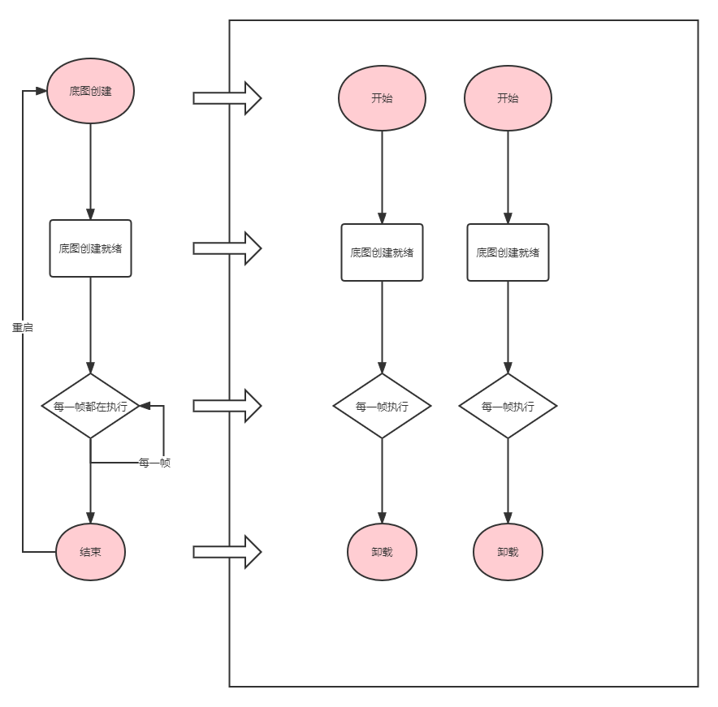
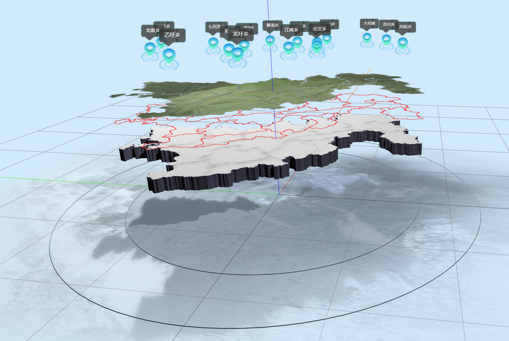
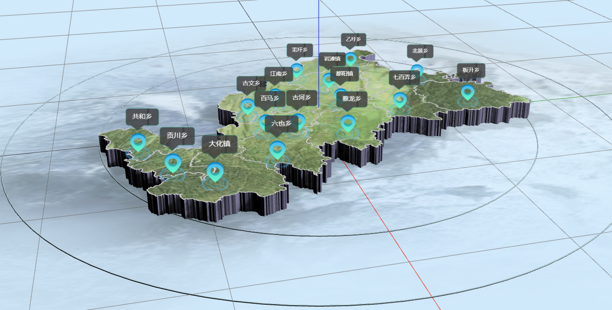

# 底图的组件实现分析

* 底图分为多个平台单独实现、最终再将实现的方案进行组合实现底图的无缝切换
* 每一个底图的库均实现了：主程 + 多个组件的形式 进行功能上的实现。如下图所示
* 底图层已经实现了飞渡平台和webgl。（51平台还未接入、接入51平台后会再整合实现无缝切换功能）



> 如上图：主程进行基础底图的创建，并且实现了5个生命周期方法进行批量的加载多个组件进行工作的方式，理论上可以通过无限的扩展组件进行底图功能的增强

* 组件的生命周期抽象如下：

```typescript
interface IComponent {
    name?: string // 组件名称（通过名称可以取到组件实例）

    onStart(): void // 开始启动（准备加载数据、创建底图实例、基础3d底图正在渲染中）
    onReady(): void // 数据准备就绪（数据完全加载完成、基础3d底图渲染完成）
    onEvent(event: IEvents): void // 用于处理组件的事件（鼠标点击、镜头切换等）
    onUpdate(deltaTime: number): void // 每一帧更新（启动后开始触发）
    onDispose(): Promise<any> // 组件卸载
}
```

* 底图组件的具体表现的效果（下图以webgl3d底图库为例，飞渡、51等形式相同）：



> 如上图共分至少5个组件：背景图、地形图、区域线条、地形贴图、标签层（每一个组件单独编写）

* 将5个组件附加到主程后完成整体的3d底图（如果需要实现更多功能，只需要编写对应的组件附加即可、可以灵活的进行拆分、合成丰富的底图结果）



### 底图的具体实现组件参考（以下根据完善程度排序）

* 飞渡云渲染：```src/hooks/freeDo/```
* ThreeJs webgl：```src/hooks/three3d/```
* 51cloud云渲染：```src/hooks/cloud51/```
