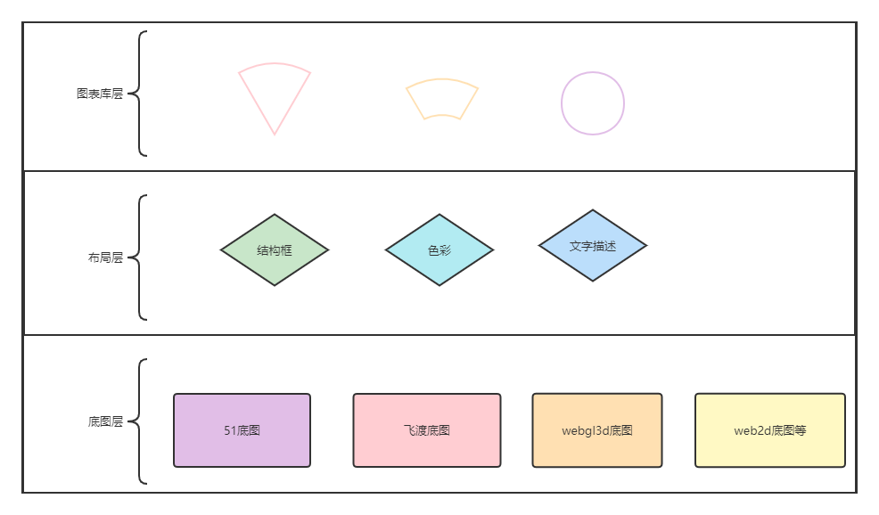

### 项目分层实现分析

> 项目如上图所示。分为：底图层、布局层、图表库层（每一层独立开发、主题等均是分离的）

### 二、布局结构层

* 布局结构层是决定项目结构的框。基本的结构如下图：
    * 1）、如下图1：基本的大框分为上、下、左、右4个部分（这个目前是固定的、比较灵活的方案还在考虑中）
    * 2）、如下图2：在大框的基础上是可以灵活的实现多个小框的（这个是根据路由地址的不同、会加载不同的页面）
    * 3）、如下图3：实际的表现效果（截图中未显示底图层，底图层是在布局最底部的，占满整个屏幕的。结构层是覆盖在底图层之上的）

