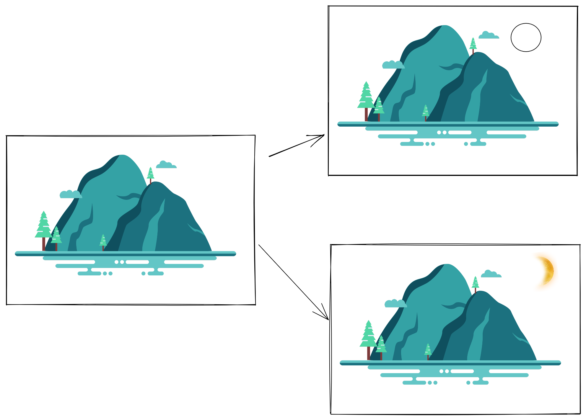

# 项目整合需求分析
* 目前公司项目存在的问题（1集团大屏、2程阳八寨、3一键游项目）
    * 三个项目独立开来，没有关联、相同的组件没有共用、样式主题更换麻烦等
    * 由于进行了多次翻新处理，项目逻辑已经相当混乱，每一次新功能都是在旧的项目上缝缝补补
    * 第三方底图切换困难，如果需要开发一个新的项目则需要在确定底图后在其基础上选用一个更接近于当前需求的项目进行（翻新=>添加新功能=>生成新项目），如下图：

> 把原有的功能（太阳注释、添加一个月亮）、初期问题不是很大、但当某一个项目翻新过多，这条链很长的时候，其内部会越来月臃肿、表面虽然没区别，但是维护成本会越来越高

### 新项目整合功能总览
* 1、整合多个底图、实现底图之间的无缝切换（目前已经加入飞渡底图、webgl3d底图）。后续加入51底图后再进行无缝切换处理
* 2、布局结构调整
    * 原项目所有的场景均只在一个页面显示、通过条件判断的形式进行不同组件之前的显示隐藏（项目越来越大后，“条件判断的逻辑”也将越来月复杂）
    * 目前使用路由进行分割不同的场景、分离细化每一个场景、实现每一个场景均有独立的一个url（减少场景中的“条件判断的逻辑”复杂度，为后续开发者减少编写成本，每一个新的场景都是新编写的，无需过度的考虑旧的逻辑是否有影响）
* 3、添加了主题色功能（下一页详细介绍）
    * 1、框架主题色
    * 2、图表库主题色
* 4、优化了项目配置功能
* 5、使用vue3 + typescript（强类型）进行编写
    * vue3的优势：可以进行更彻底的提取逻辑、将相同的功能的逻辑与页面分离、更容易的进行组件化。一些常用的基础功能尽量进行统一的组件化处理（比如3种底图之间是单独编写的、切换的时候无需关心其内部细节逻辑、只要根据底图组件提供的api、在其基础上再加一层代理即可）
    * typescript（强类型）的优势：尽量做到代码既文档、让后续的开发者可快速接手，对于一些公共的组件可以快速调用而无需再花费太多的时间查看内部逻辑
* 6、如果需要开发一个新项目则只需要在整合好的基础项目进行分裂出子项目即可，应该严禁一层层的分裂，如下图所示：

> 由于每一个新项目都是“基础项目”的子集、不会再有下一级的子集。这样的好处是可以直接删除，因为每一个都是从母体模板分离的，这里直接删掉不会对母体有任何影响。比如：上图的“太阳组件”

> 旧项目是否也可以提取母体模板？但目前已经分裂出了很多代，提取出一份简洁的模板工作量比较大 
