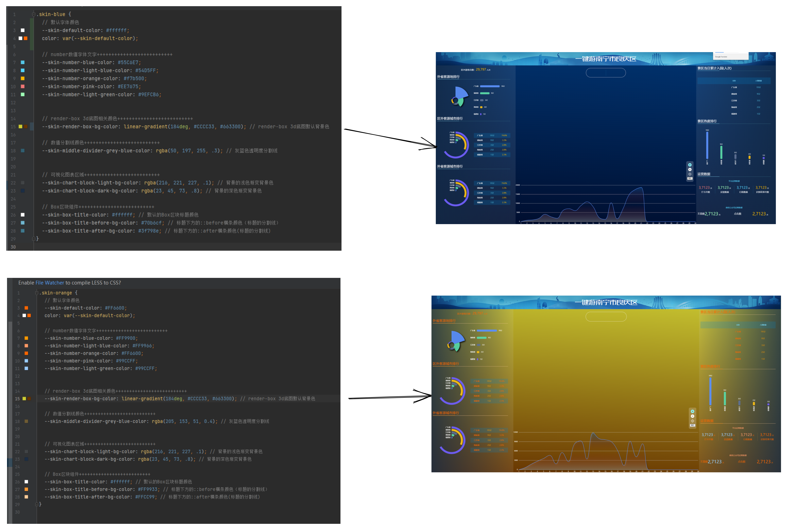

# css样式的说明与皮肤说明

* ```src/styles/```做了完善的屏幕适配和主题色切换功能，在```vite.config.js```中自动导入
* 皮肤主题功能：
    * 使用了 css的```var()```变量功能实现，其中用到的所有类目都应该在```src/styles/skins/index.less```中定义(其中```skin-blue```表示皮肤的名称，可在js基础配置中指定当前使用哪一套皮肤)
    * ```src/styles/skins/skin-*.less```
      为实际的每一套皮肤对应css变量值，为了方便生产环境中快速的修改添加皮肤，可以提取到项目根目录下的```public/skins.css```
      文件中定义，然后通过```index.html```引入即可
    * 具体应用到皮肤的名称类样式实现位于```App.vue```文件中

```css
.skin-blue {
    /*文本基础色++++++++++++++++++++++++++*/
    --skin-text-color: #ffffff; /*默认的字体颜色*/
    color: var(--skin-text-color);
    font-size: 21px;
    --skin-group-title-text-color: #14C3FF; /*广旅集团总的小标题等文字颜色*/
    --skin-group-amounts-text-color: #45B7C5; /*广旅集团总的金额、人数等文字颜色*/
    --skin-group-amounts-unit-color: #FFC44E; /*广旅集团总的单位、比例等文字颜色*/


    /*render-box 3d底图相关颜色++++++++++++++++++++++++++*/
    --skin-render-box-bg-color: #041934; /*render-box 3d底图默认背景色*/

    /*数值分割线颜色++++++++++++++++++++++++++*/
    --skin-middle-divider-grey-blue-color: rgba(50, 197, 255, .3); /*灰蓝色透明度分割线*/


    /*可视化图表区域++++++++++++++++++++++++++ transparent*/
    --skin-chart-block-light-bg-color: transparent; /*背景的浅色渐变背景色*/
    --skin-chart-block-dark-bg-color: transparent; /*背景的深色渐变背景色*/

    /*Box区块组件++++++++++++++++++++++++++*/
    --skin-box-bg-color: rgba(1, 64, 108, 0.55); /* box区块的背景颜色*/
    --skin-box-title-color: #ffffff; /*默认的Box区块标题颜色*/
    --skin-box-title-before-bg-color: #70b6cf; /*标题下方的::before横条颜色（标题的分割线）*/
    --skin-box-title-after-bg-color: #3f798e; /*标题下方的::after横条颜色(标题的分割线)*/
    --skin-box-title-font-size: 14px; /*标题的文字大小*/


    /*下拉框组件++++++++++++++++++++++++++*/
    --skin-drop-down-color: #B4D9E9; /*下拉框文字颜色*/
    --skin-drop-down-font-size: 25px; /*下拉框文字大小*/
    --skin-drop-down-option-font-size: 12px; /*下拉框选项文字大小*/
    --skin-drop-down-option-bg-color: #152b49; /*下拉框选项背景颜色*/

}

```


* 如下图为两个主体色方案，使用了预定义好的基础色调的css变量的形式进行，主题色的控制


